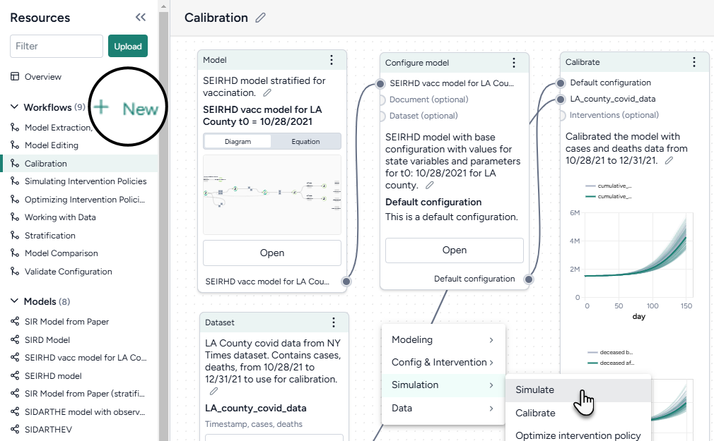
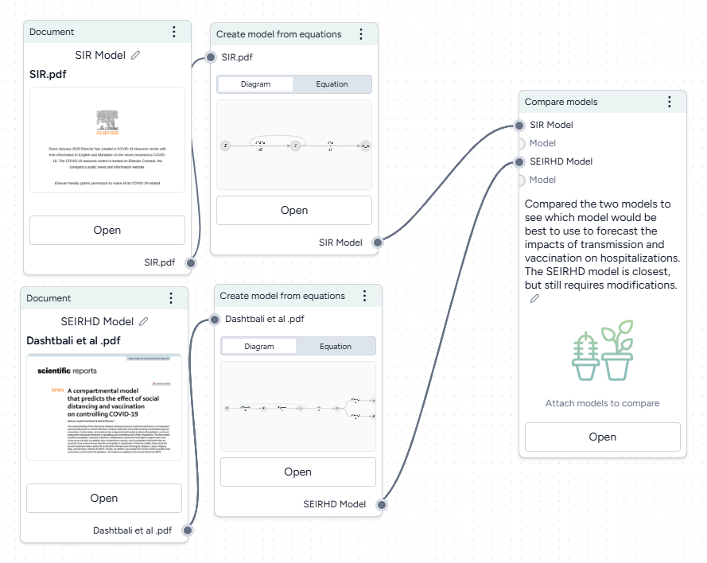
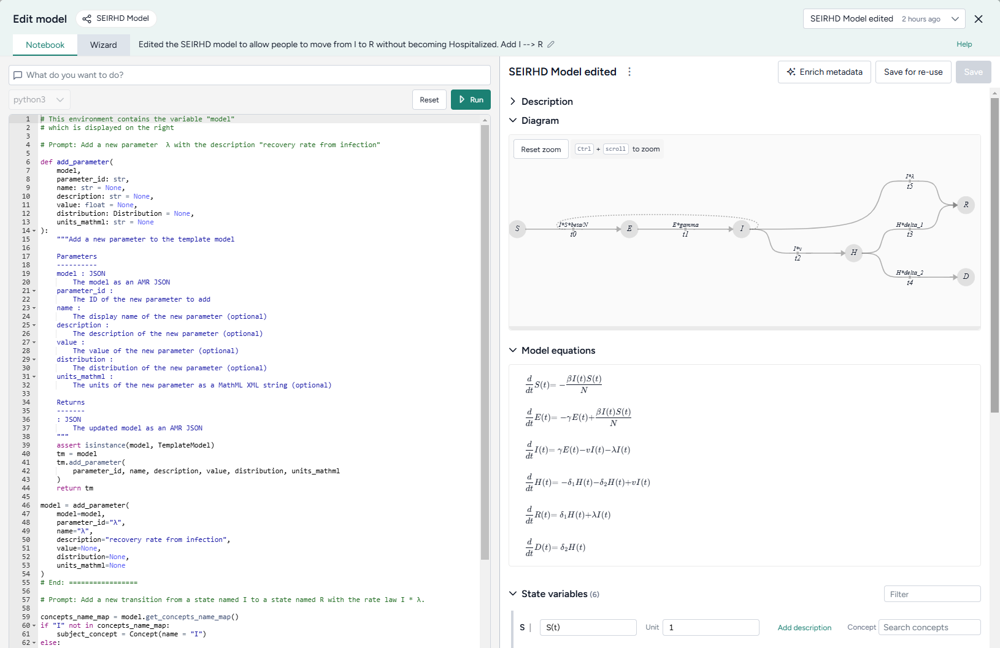
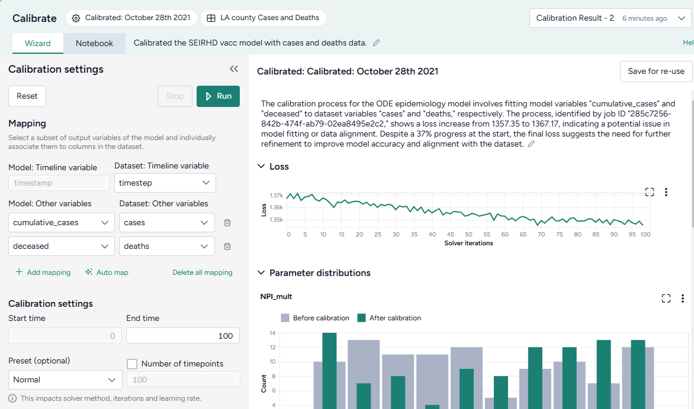

# Integrated HMI System: Terarium Workbench
{: .no_toc }

<details open markdown="block">
  <summary>
    Table of contents
  </summary>
  {: .text-delta }
1. TOC
{:toc}
</details>

## Overview

The Terarium workbench, developed by Uncharted Software, serves as the main human-machine interface (HMI) for the ASKEM program. It enables users to accelerate scientific decision-making by applying ASKEM technology to models and simulations. By pairing their expertise with AI, users can build on existing models and data to simulate and communicate complex real-world scenarios.

#### *Target Users*

Terarium provides a low-code environment where modelers can recreate, refine, and experiment with models and simulations. Users don't need to be experts---they can build off work shared by others or pair their domain knowledge with AI assistance to perform otherwise complex or time-consuming tasks. 

Terarium also supports expert modelers by providing integrated notebook interfaces for direct coding. Terarium's streamlined interfaces for non-experts, AI assistants, and code notebooks work seamlessly together, allowing users to choose the workflow that suits them best and offering a pathway to deeper understanding.

#### *Features Supported*



[Scientific modeling workflows]()

* Visually connect data, papers, and models with modeling and simulation operators to build reproducible workflows.
* Apply pre-constructed workflow templates to quickly connect and configure resources to a series of modeling operations.
* Leverage flexible support for configuring and running complex modeling tasks: 
  * Choose from a simplified set of default values,
  * Prompt an AI assistant to write and execute code, or
  * Write custom code.
* Non-linear and iterative workflows support experimentation and comparisons of multiple scenarios.
* Share captured insights with other users to disseminate results and enable reuse of modeling resources and results.



[Model recreation]()

* Leverage the work of others by:
  * Uploading resources such as scientific literature (PDFs), datasets, and models.
  * Searching the Terarium workbench for relevant resources and workflows.
* Enrich resources to add additional context that improves structural comparisons and alignment of models and data. 
* Automatically extract models, parameter values, and intervention policies from uploaded scientific literature.
* Choose a starting point by guiding the creation of AI-generated model cards to compare the biases, limitations, strengths, and uses of multiple models.



[Model extension/edits and validation]()

* Refine the structure of existing models. Add, remove, rename, or change variables, transitions, or parameters.
* Stratify a simple model by location or demographics to effectively combine many different variations into one large model.
* Choose initial values and parameters for a model condition or automatically extract them from a document or dataset. 
* Configure model parameters to account for uncertainty in downstream simulations.
* Use [Funman]() satisfiability to check candidate model outputs for mistakes, common-sense rules, and unphysical predictions.



[Simulation]()

* Improve the performance of a model by running a deterministic or probabilistic calibration to a reference dataset.
* Perform a deterministic or probabilistic simulation to forecast a model's underlying system behavior under specific conditions.
* Use sensitivity analysis to determine how changes in model parameters affect outcomes (e.g., *how do varying vaccination rates and transmission impact hospitalizations?*).
* Create and optimize intervention policies to answer key decision-maker questions like *How does increasing vaccination rate affect cases and hospitalizations*.
* Jointly calibrate or simulate multiple models together so they combine to generate predictions with lower error than individual models.
* Compare simulation results to understand the impact of scenarios, rank interventions based on multiple criteria, or assess model errors.

[Dataset transformation]()

* Manipulate, summarize, and visualize datasets to align with your modeling goals.
* Create new variables, filter data, join datasets, perform mathematical operations, add or drop columns, sort data, or handle missing values.
* Convert incidence data (such as daily new case counts) to prevalence data (total case counts at any given time).
* Calculate summary statistics, plot data, and answer specific questions about a dataset.

## Installation and Configuration Instructions

The following steps show how to set up and run the Terarium application in your local development environment. These instructions assume that you have installed [Docker](https://www.docker.com/) and have an [OpenAI API key](https://platform.openai.com/api-keys).

1. **Clone the repository**.

   ```bash
   git clone <your-repo-url>
   cd <your-repo-name>/deploy
   ```

2. **Create the environment file**. Inside the `deploy/` folder:

   1. Copy the environment template file.
  
      ```bash
      cp .env_template .env
      ```
  
   2. Open the `.env` file and add your OpenAI API key (**`secret_openai_key`**).

3. **Set up the hosts file**. To ensure the application can resolve the correct hostnames, you may need to add the following lines to your `/etc/hosts` file (Linux/Mac) or `C:\Windows\System32\drivers\etc\hosts` (Windows).

   ```
   127.0.0.1  keycloak
   127.0.0.1  minio
   ```

4. **Launch the application**. To start all the required system components in the background, run the following command from the `deploy/` folder.

   ```bash
   docker compose up -d
   ```

5. **Access the application**. Once the containers are running, navigate to [http://localhost:8080](http://localhost:8080) in your web browser.

#### Login Credentials

You can log in using either of the following user accounts.

| Username | Password | Role  |
|----------|----------|-------|
| adam     | admin123 | Admin |
| ursula   | user123  | User  |

## Examples

Examples of how to use Terarium to build scientific modeling workflows that simulate and communicate complex real-world scenarios appear throughout the following sections:

- [Scientific Modeling Workflows]()
- [Choosing a Starting Point]()
- [Augmenting Models]()
- [Simulating Models]()
- [Transforming Data]()

## Publications

P. Proulx, J. Waese, M.-W. Chang, L. C. Liu, H. Vasquez, N. Graham, D. Gauldie, Y. Paris, D. Vince, C. Coleman, K. Birk, J. Ryu, C. Blanchard, E. Lai, T. Szendrey, J. Whiting, S. Yama, D. Schroh, D. Jonker, B. Rose, M. Printz, and F. Grant, "Towards Accessible, Flexible and Collaborative Scientific Modeling with Terarium," In *1st ACM CHI Workshop on Human-Notebook Interactions*, Honolulu, HI, May 2024, [https://github.com/HumanNotebookInteractions/HumanNotebookInteractions.github.io/blob/main/Papers/CHI_Terarium_Submission_22Mar2024.pdf](https://github.com/HumanNotebookInteractions/HumanNotebookInteractions.github.io/blob/main/Papers/CHI_Terarium_Submission_22Mar2024.pdf)

## Contact Information for Questions

[support@terarium.ai](mailto:support@terarium.ai)